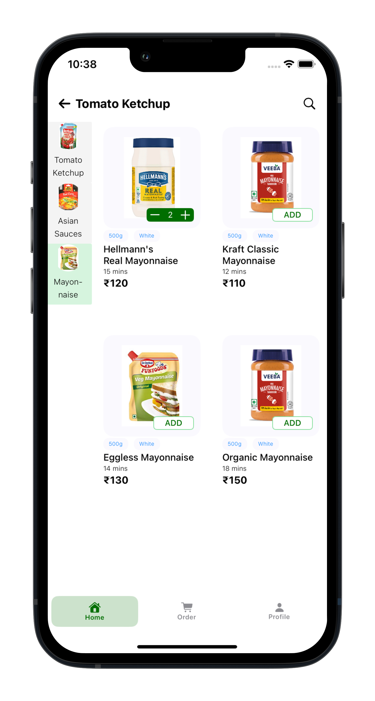

# Rahul Rai

--- 

## 👨‍💻 About Me  
- Self taught iOS developer 
- Love to mimic and make complex UI animations and effects, both on my own and through blogs for iOS devices.
- Passionate about solving complex problems in mobile app development.
- Experience in Web development, Backend (Flask), Databases, Machine Learning, and Data Science through university courses and mini projects.
- Constantly learning and exploring 

---

## 🎓 Education  
- 🎓 **IIT Gandhinagar (India)**  
  - **Degree**: B.Tech in Computer Science and Engineering  
  - **Graduation**: 2024  

---

## 💼 Work Experience  
- 🛠️ **SDE(iOS) Intern @Truminds, Gurugram (May 2023 – July 2023)**  
  - Researched tunneling protocols for VPN establishment, including Personal VPN using IKEv2 protocol and Packet Tunnel Provider using a custom protocol within Apple's Network Extensions API.
  - Did packet handling and crafted a customized tunnel protocol, enabling successful connection to a remote server and seamless transmission of IP Packets.

---

## 📱 iOS Projects  

### **Swipe App** [GitHub Link](https://github.com/RahulRai02/SwipeTakeHomeAssignment)

<table style="width:100%; text-align:center; border-spacing: 20px;">
  <tr>
    <td></td>
    <td></td>
    <td></td>
  </tr>
  <tr>
    <td></td>
    <td></td>
    <td></td>
  </tr>
  <tr>
    <td></td>
    <td></td>
    <td></td>
  </tr>
  <tr>
    <td></td>
    <td></td>
    <td></td>
  </tr>
</table>

- **Tech Stack**: Swift, SwiftUI, Combine, UIKit (For Photo Picker)
- **Key Features**:  
  - 2 Screens: Product Listing and Add Product following MVVM architecture
  - Display a scrollable list of products retrieved from an API.
  - Search through the product list in real time.
  - Favorite Feature: Favorited products appear at the top of the list, saved locally.
  - Add Product form validation for all fields
  - Image upload, using UIKIT's UIImagePickerController
  - Offline functionality: When internet goes off and you try adding a product it gets saved locally in CoreData and once the internet is back, click sync button and the product will get synced.
  - Alerts for errors and successful addition of products.

### **Blinkit Clone** [GitHub Link](https://github.com/RahulRai02/BlinkitCloneSwift)

<table>
  <tr>
    <td></td>
    <td></td>

  </tr>
  <tr>
    <td></td>
    <td></td>
  </tr>
  <tr>
    <td></td>
    <td></td>
  </tr>
  <tr>
    <td></td>
    <td></td>
  </tr>
  <tr>
     <td></td>
    <td></td>
  </tr>
</table>

- **Tech Stack**: Swift, SwiftUI, CoreData, App Storage, CoreLocation, MapKit 
- **Key Features**:  
  - Pull Down and Pull up gesture: Pulling down from 2nd category, switches to first category. Similary for pull up from where the content ends switches to next category. 
  - Complex 2 partion Layout following MVVM architecture
  - Add to Cart functionality
  - Add to cart button animation shown when qunaity is 0 or more. if more + and - shown.. Consistent across other views as well.
  - Order Total
  - Account Screen for User data and addresses.
  - App Storage for user data
  - Core Data for CRUD on Addresses
  - Location Sheet, takes user current location, used Core Location

---

## 🛠️ Skills  
- **Languages**: Swift, Python(NumPy, Pandas, Scikit-Learn, Matplotlib), C++, C, HTML, Bootstrap, SQL, Javascript
- **Frameworks**: SwiftUI, CoreData, MapKit, CoreLocation, UIKit, Combine, Flask
- **Tools**: XCode, Git, Github, MySQL, Docker, Wireshark,   

---

## 🏆 Achievements

- **5th place** in IITGN’s **HACKRUSH Hackathon** (1st among 2nd-year participants).
- **1st school rank**, **19th state rank** in **National Cyber Olympiad**, awarded **Zonal Gold Medal**.
- Solved **450+ problems** on **Leetcode** and **GFG**.
- Qualified for **Publicis Sapient Jumpstart 2022** (out of 29,000+ students).
guage with bytecode execution.  

---

## 📧 Contact Me 
- **Email**: rahulr0211@gmail.com
- **LinkedIn**: [linkedin.com/in/rahulrai](https://www.linkedin.com/in/rahulrai02/)  

