# Rahul Rai

--- 

## 👨‍💻 About Me  
- Self taught iOS developer 
- Love to mimic and make complex UI animations and effects, both on my own and through blogs for iOS devices.
- Passionate about solving complex problems in mobile app development.
- Experience in Web development, Backend (Flask), Databases, Machine Learning, and Data Science through university courses and mini projects.
- Constantly learning and exploring 

---

## 🎓 Education  
- 🎓 **IIT Gandhinagar (India)**  
  - **Degree**: B.Tech in Computer Science and Engineering  
  - **Graduation**: 2024  

---

## 💼 Work Experience  
- 🛠️ **SDE(iOS) Intern @Truminds, Gurugram (May 2023 – July 2023)**  
  - Researched tunneling protocols for VPN establishment, including Personal VPN using IKEv2 protocol and Packet Tunnel Provider using a custom protocol within Apple's Network Extensions API.
  - Did packet handling and crafted a customized tunnel protocol, enabling successful connection to a remote server and seamless transmission of IP Packets.

---

## 🚀My Self-Taught iOS Journey 

  - As a **self-taught iOS developer**, I have explored and implemented various concepts in **Swift** and **SwiftUI**. Check out my learning repository on my [Swift & SwiftUI Learning Repositry](https://github.com/RahulRai02/Grind_Swift_And_SwiftUI).

---

## 📱 iOS Projects  

### **Swipe App** [🔗](https://github.com/RahulRai02/SwipeTakeHomeAssignment)

<table style="width:100%; text-align:center; border-spacing: 20px;">
  <tr>
    <td>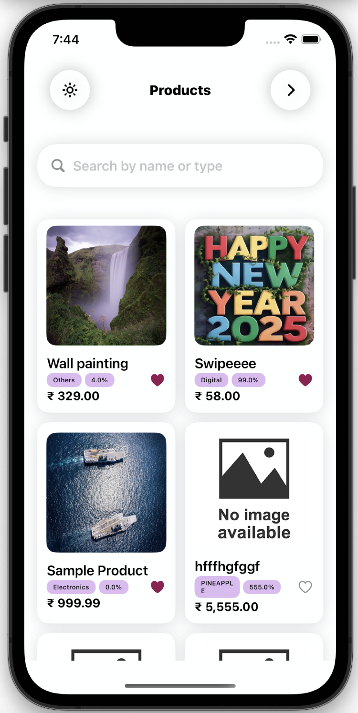</td>
    <td></td>
    <td>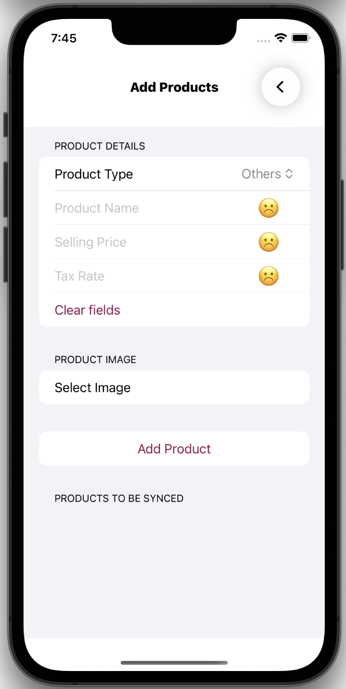</td>
  </tr>
  <tr>
    <td>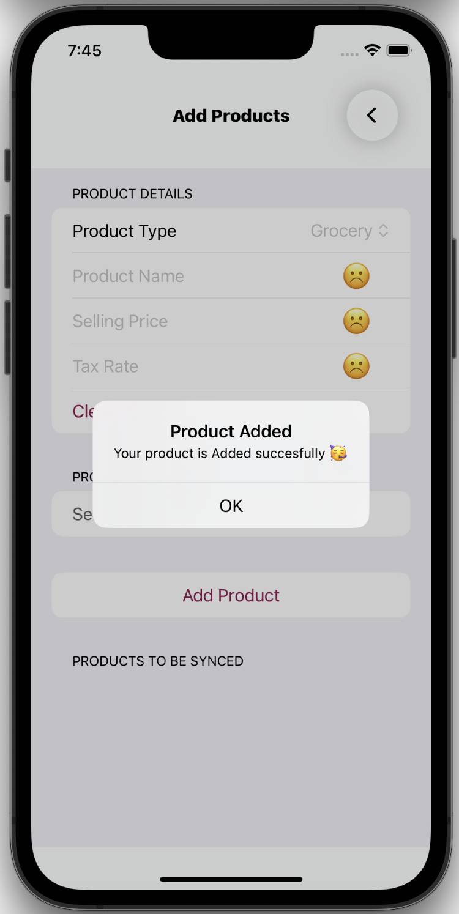</td>
    <td>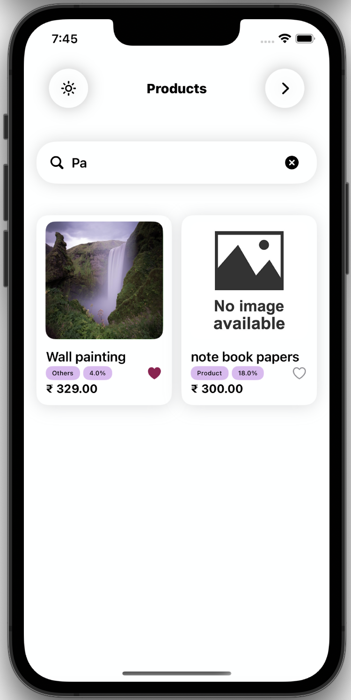</td>
    <td>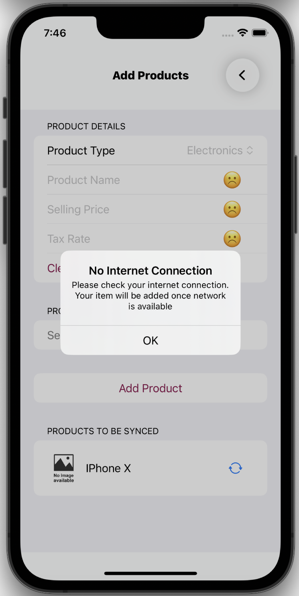</td>
  </tr>
</table>

- **Tech Stack**: Swift, SwiftUI, Combine, UIKit (For Photo Picker)
- **Key Features**:  
  - Screens:  
    - **Product Listing**: View and search through a list of products.  
    - **Add Product**: Add new products with form validation and image upload.  

  - **Functionalities**:  
    - **Scrollable Product List**: Fetch and display products from an API.  
    - **Real-Time Search**: Instantly filter products as you type.  
    - **Favorites**: Mark products as favorite, saved locally and displayed at the top of the list.  
    - **Add Product Form**: Validate all fields and upload images using UIImagePickerController.  
    - **Offline Mode**: Save products offline using Core Data and sync them once the internet is back.  
    - **Alerts**: Notify users about errors or successful actions.  

### **Blinkit Clone** [🔗](https://github.com/RahulRai02/BlinkitCloneSwift)

<table>
  <tr>
    <td>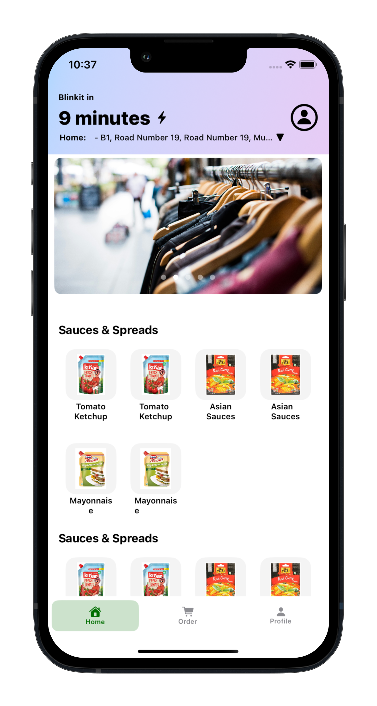</td>
    <td>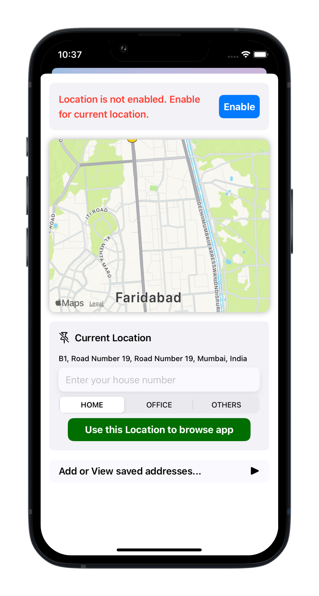</td>
  <td>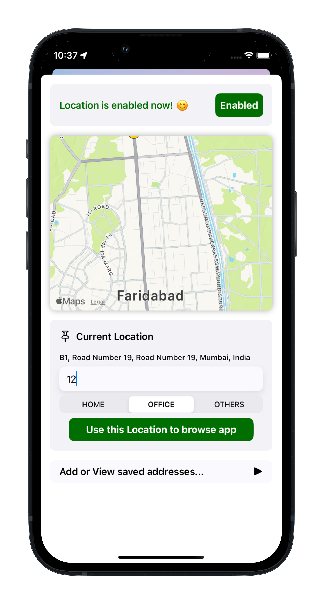</td>
  </tr>
  <tr> 
    <td>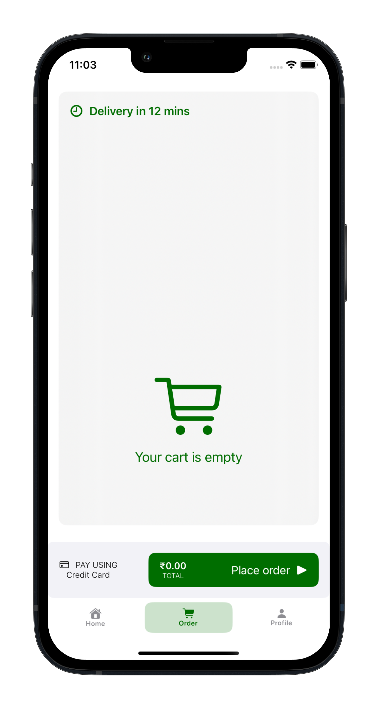</td>
    <td>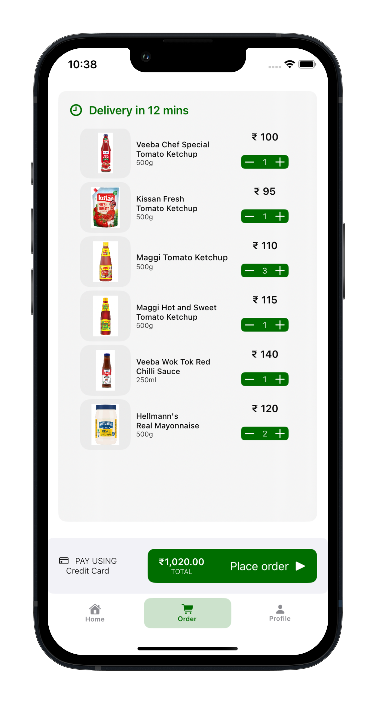</td>
    <td>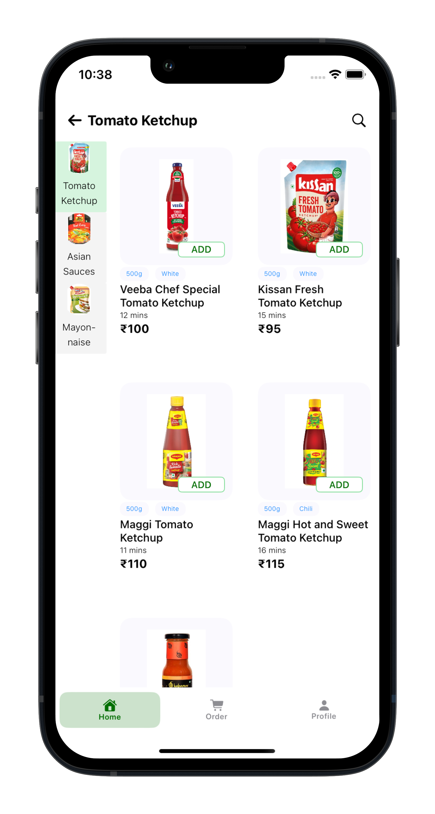</td>
  </tr>
  <tr>
    <td>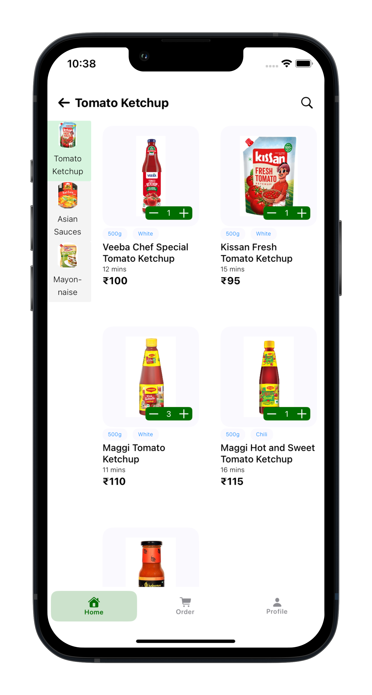</td>
    <td>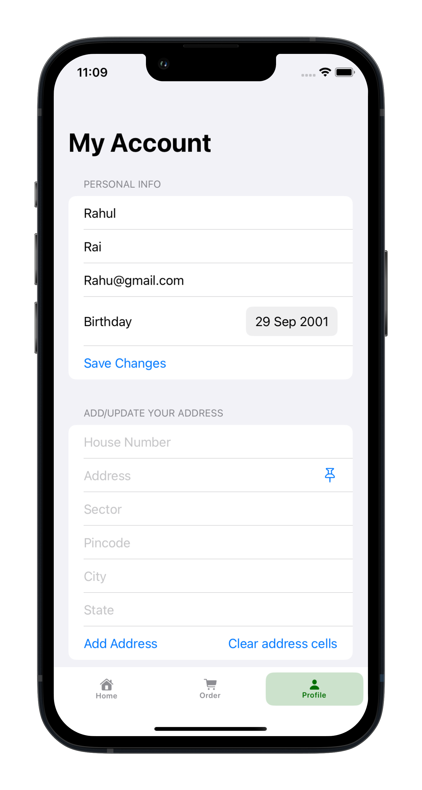</td>
    <td>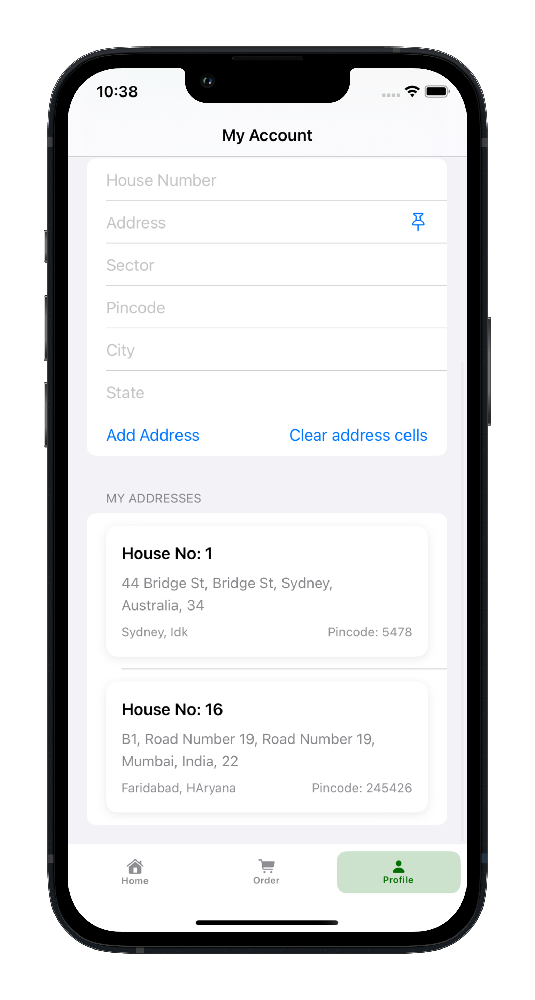</td>
  </tr>
</table>

- **Tech Stack**: Swift, SwiftUI, CoreData, App Storage, CoreLocation, MapKit 
- **Key Features**:  
  - **Gesture Navigation**: Pull down/up gestures for category switching.  
  - **Dynamic Layout**: Complex two-part layout using **MVVM architecture**.  
  - **Add to Cart**: Animated add-to-cart functionality with dynamic quantity controls.  
  - **Order Summary**: Displays order total in real time.  
  - **Account Screen**: Manage user data and addresses.  
  - **Persistence**:  
    - **AppStorage** for user data.  
    - **Core Data** for address CRUD operations.  
  - **Location Integration**: Location sheet using **Core Location** to fetch user’s current location.  

---

## 🛠️ Skills  
- **Languages**: Swift, Python(NumPy, Pandas, Scikit-Learn, Matplotlib), C++, C, HTML, Bootstrap, SQL, Javascript
- **Frameworks**: SwiftUI, CoreData, MapKit, CoreLocation, UIKit, Combine, Flask
- **Tools**: XCode, Git, Github, MySQL, Docker, Wireshark,   

---

## 🏆 Achievements

- 5th place in IITGN’s HACKRUSH Hackathon (**1st** among 2nd-year participants).
- 1st school rank, 19th state rank in National Cyber Olympiad, awarded **Zonal Gold Medal**.
- Solved **450+** problems on [**Leetcode 🔗**](https://leetcode.com/u/rahulrai_02/) and [**GFG 🔗**](https://www.geeksforgeeks.org/user/rahu02/).
- Qualified for **Publicis Sapient Jumpstart 2022** (out of 29,000+ students).
 
---

## 📧 Contact Me 
- **Email**: rahulr0211@gmail.com
- **LinkedIn**: [linkedin.com/in/rahulrai](https://www.linkedin.com/in/rahulrai02/)  

