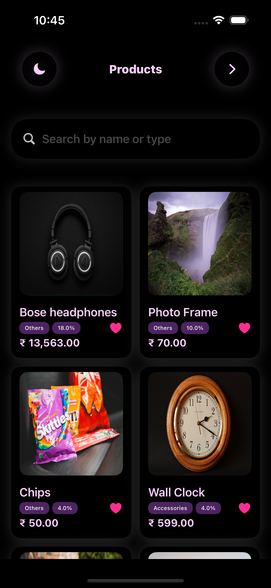
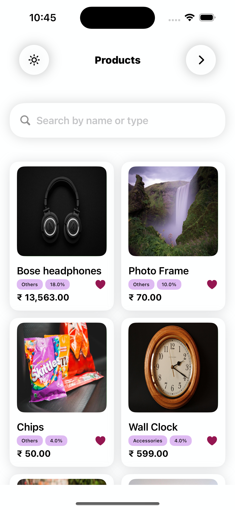
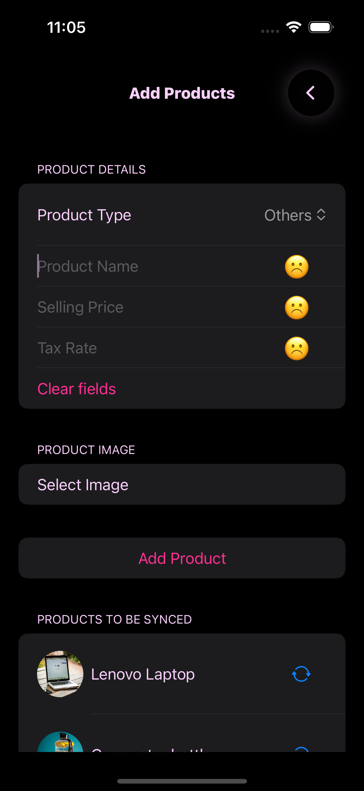
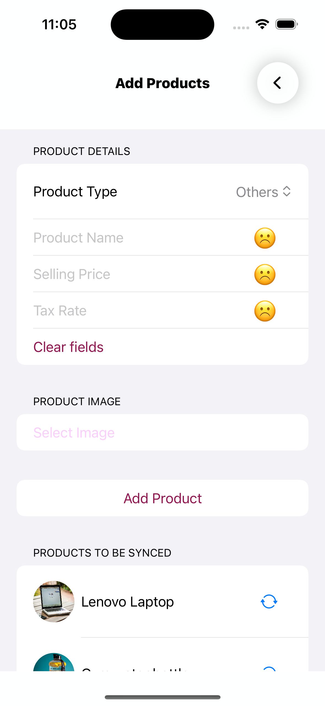
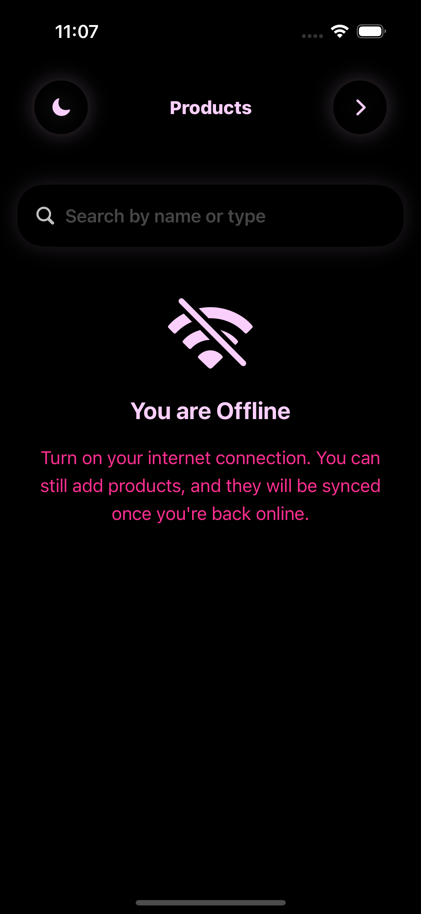
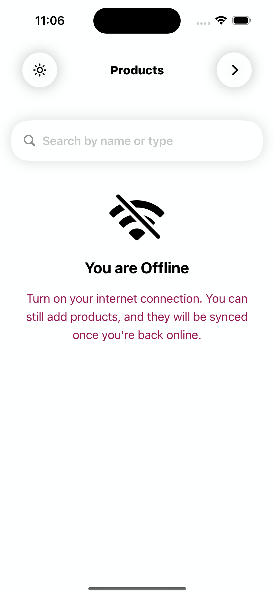
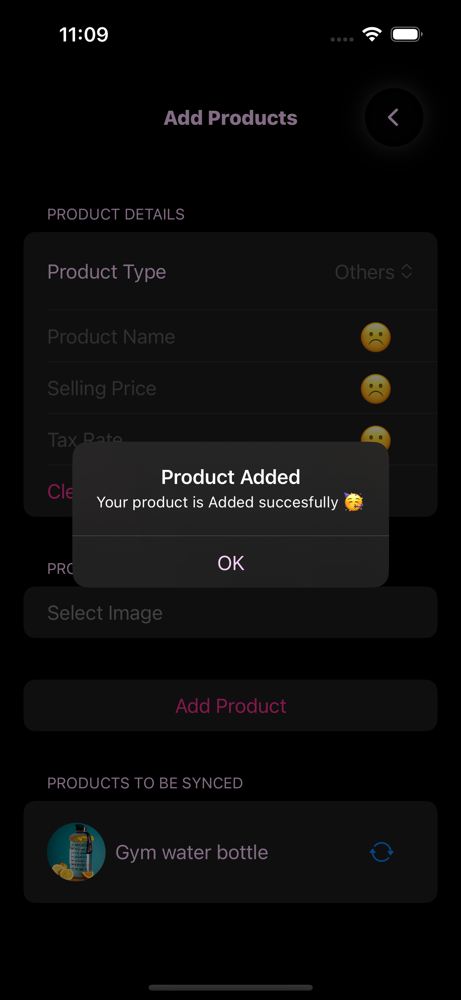
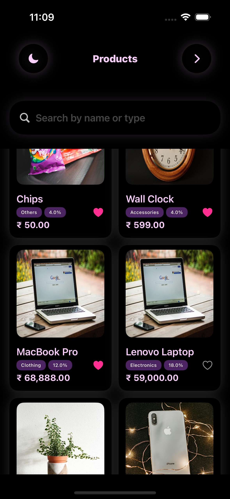
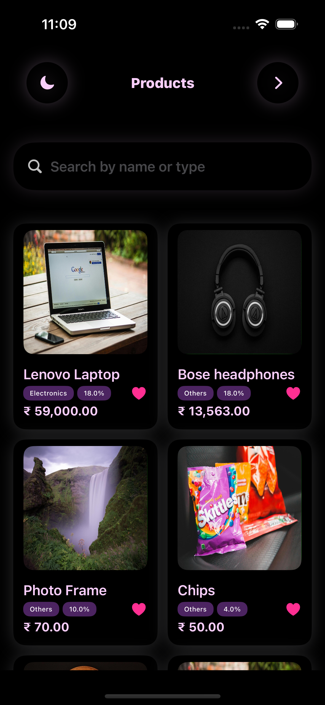
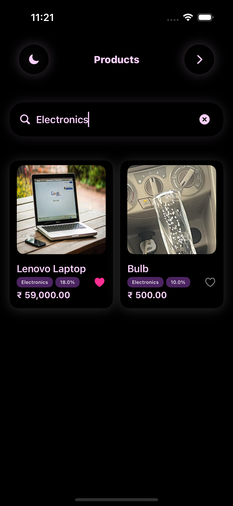

# Rahul Rai

iOS Developer | SDE

---

## 🎓 Education  
- 🎓 **IIT Gandhinagar**  
  - **Degree**: B.Tech in Computer Science and Engineering  
  - **Graduation**: 2024  

---

## 💼 Work Experience  
- 🛠️ **SDE(iOS) Intern (May 2023 – July 2023)**  
  - Researched tunneling protocols for VPN establishment, including **Personal VPN** using **IKEv2** protocol and **Packet Tunnel Provider** using a custom protocol within **Apple's Network Extensions API**.
  - Did **packet handling** and crafted a **customized tunnel protocol**, enabling **successful connection** to a **remote server** and seamless transmission of **IP Packets**.


---

## 📱 Projects  

### **Blinkit Clone**  
<!-- 
<table>
  <tr>
    <td><a href="https://github.com/user-attachments/assets/4f79bbe8-4ac8-4276-8216-8a8dbe1557d5" target="_blank">
        </a></td>
    <td></td>
    <td></td>
  </tr>
  <tr>
    <td></td>
    <td></td>
    <td></td>
  </tr>
  <tr>
    <td></td>
    <td></td>
    <td></td>
  </tr>
  <tr>
    <td></td>
  </tr>
</table> -->


- **Tech Stack**: Swift, SwiftUI  
- **Key Features**:  
  - Vertical product list  
  - Custom tab bar  
  - Core Data integration  

---

### **Swipe App**  

<table style="width:100%; text-align:center; border-spacing: 20px;">
  <tr>
    <td></td>
    <td></td>
    <td></td>
  </tr>
  <tr>
    <td></td>
    <td></td>
    <td></td>
  </tr>
  <tr>
    <td></td>
    <td></td>
    <td></td>
  </tr>
  <tr>
    <td></td>
    <td></td>
    <td></td>
  </tr>
</table>


- **Tech Stack**: SwiftUI  
- **Key Features**:  
  - Smooth swipe gestures  
  - Intuitive design  

---

## 🛠️ Skills  
- **Languages**: Swift, Python, C++  
- **Frameworks**: SwiftUI, Core Data, MapKit  
- **Tools**: Git, Overleaf  

---

## 🏆 Achievements  
- **Cyber Security Hackathon Winner**  
  - Secured 1st place at IIT Gandhinagar hackathon.  

- **Compiler Project**  
  - Created a hybrid programming language with bytecode execution.  

---

## 👨‍💻 About Me  
- Passionate about mobile app development and solving complex problems.  
- Constantly learning and exploring new technologies.  

---

## 📧 Contact  
- **Email**: rahul.rai@example.com  
- **LinkedIn**: [linkedin.com/in/rahulrai](https://linkedin.com/in/rahulrai)  


Text can be **bold**, _italic_, or ~~strikethrough~~.

[Link to another page](./another-page.html).

There should be whitespace between paragraphs.

There should be whitespace between paragraphs. We recommend including a README, or a file with information about your project.

# Header 1

This is a normal paragraph following a header. GitHub is a code hosting platform for version control and collaboration. It lets you and others work together on projects from anywhere.

## Header 2

> This is a blockquote following a header.
>
> When something is important enough, you do it even if the odds are not in your favor.

### Header 3

```js
// Javascript code with syntax highlighting.
var fun = function lang(l) {
  dateformat.i18n = require('./lang/' + l)
  return true;
}
```

```ruby
# Ruby code with syntax highlighting
GitHubPages::Dependencies.gems.each do |gem, version|
  s.add_dependency(gem, "= #{version}")
end
```

#### Header 4

*   This is an unordered list following a header.
*   This is an unordered list following a header.
*   This is an unordered list following a header.

##### Header 5

1.  This is an ordered list following a header.
2.  This is an ordered list following a header.
3.  This is an ordered list following a header.

###### Header 6

| head1        | head two          | three |
|:-------------|:------------------|:------|
| ok           | good swedish fish | nice  |
| out of stock | good and plenty   | nice  |
| ok           | good `oreos`      | hmm   |
| ok           | good `zoute` drop | yumm  |

### There's a horizontal rule below this.

* * *

### Here is an unordered list:

*   Item foo
*   Item bar
*   Item baz
*   Item zip

### And an ordered list:

1.  Item one
1.  Item two
1.  Item three
1.  Item four

### And a nested list:

- level 1 item
  - level 2 item
  - level 2 item
    - level 3 item
    - level 3 item
- level 1 item
  - level 2 item
  - level 2 item
  - level 2 item
- level 1 item
  - level 2 item
  - level 2 item
- level 1 item

### Small image


### Large image


### Definition lists can be used with HTML syntax.

<dl>
<dt>Name</dt>
<dd>Godzilla</dd>
<dt>Born</dt>
<dd>1952</dd>
<dt>Birthplace</dt>
<dd>Japan</dd>
<dt>Color</dt>
<dd>Green</dd>
</dl>

```
Long, single-line code blocks should not wrap. They should horizontally scroll if they are too long. This line should be long enough to demonstrate this.
```

```
The final element.
```
