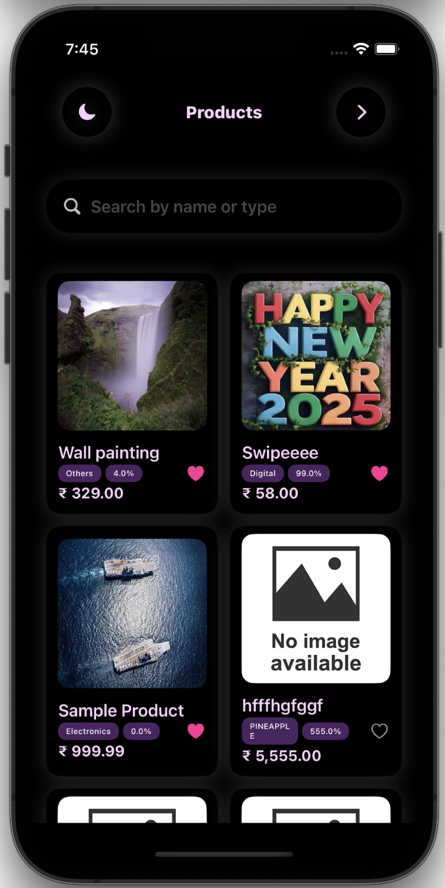
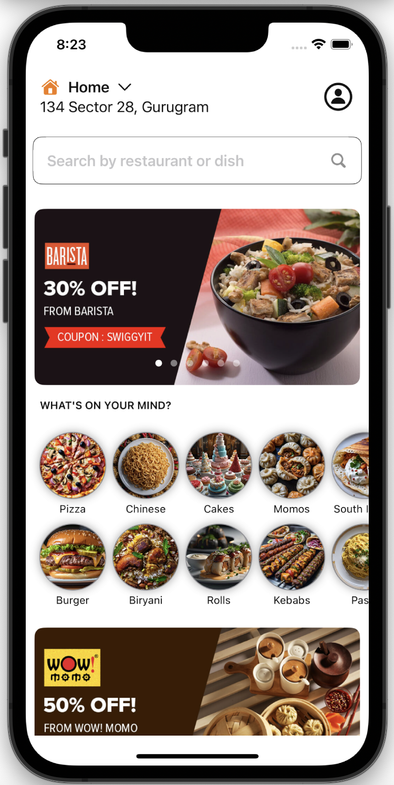
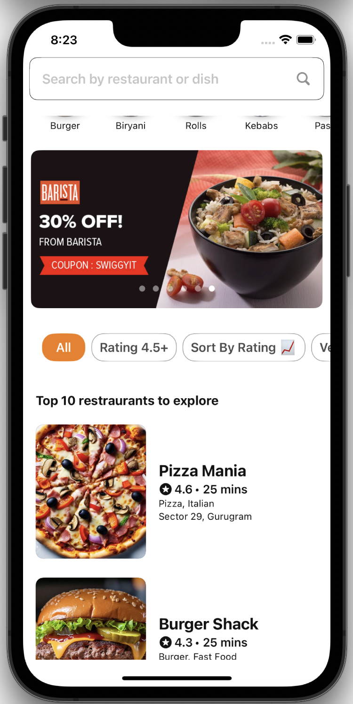
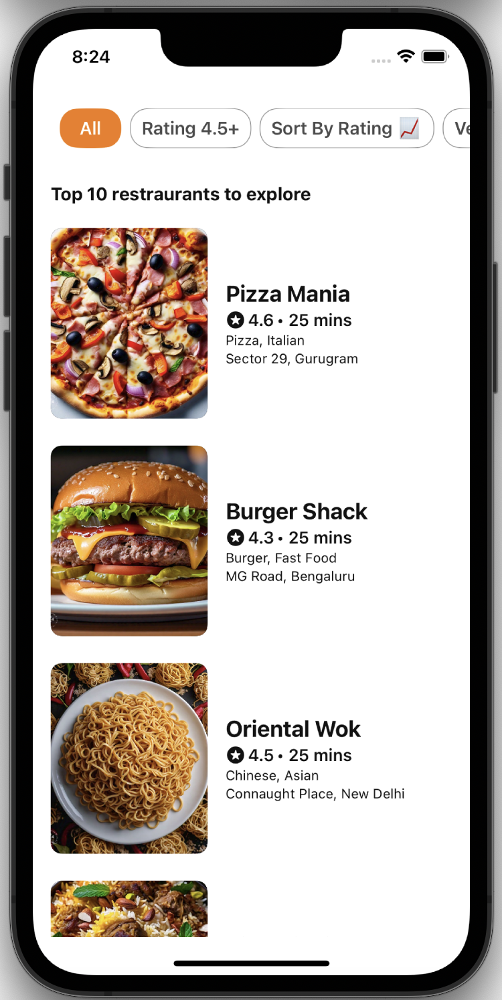
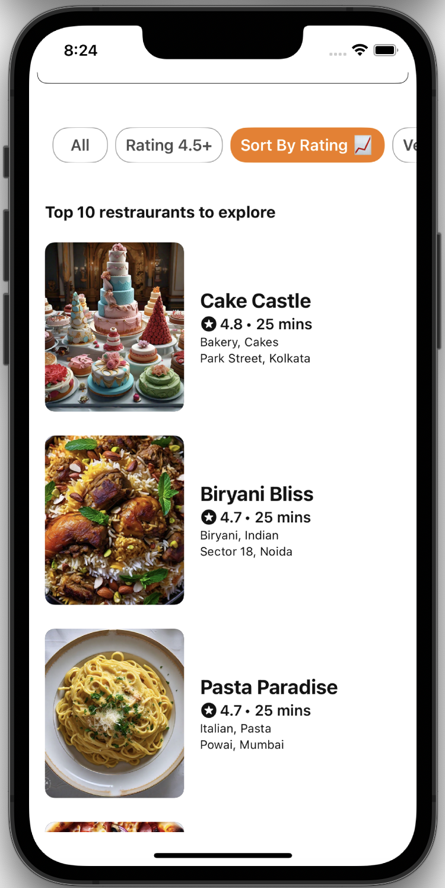
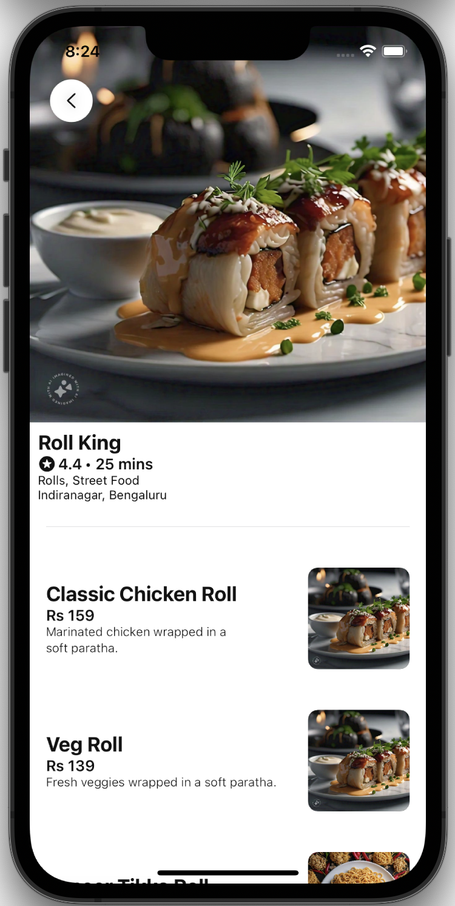
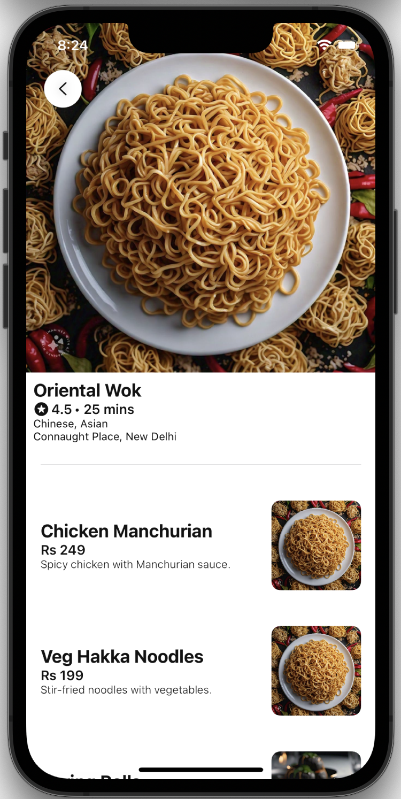

# Rahul Rai

--- 

## 👨‍💻 About Me  
- Self taught iOS developer 
- Love to mimic and make complex UI animations and effects, both on my own and through blogs for iOS devices.
- Passionate about solving complex problems in mobile app development.
- Experience in Web development, Backend (Flask), Databases, Machine Learning, and Data Science through university courses and mini projects.
- Constantly learning and exploring 

---

## 🎓 Education  
- 🎓 **IIT Gandhinagar (India)**  
  - **Degree**: B.Tech in Computer Science and Engineering  
  - **Graduation**: 2024  

---

## 💼 Work Experience  
- 🛠️ **SDE(iOS) Intern @Truminds, Gurugram (May 2023 – July 2023) [🔗](https://drive.google.com/file/d/1n5pXU0jbVck4XtlREtFdcxq344s0lPR9/view)**  
  - Researched tunneling protocols for VPN establishment, including Personal VPN using IKEv2 protocol and Packet Tunnel Provider using a custom protocol within Apple's Network Extensions API.
  - Did packet handling and crafted a customized tunnel protocol, enabling successful connection to a remote server and seamless transmission of IP Packets.

---

## 🚀My Self-Taught iOS Journey 
  - As a **self-taught iOS developer**, I have explored and implemented various concepts in **Swift** and **SwiftUI**. Check out my learning repository on my [Swift & SwiftUI Learning Repositry](https://github.com/RahulRai02/Grind_Swift_And_SwiftUI).

---

## 📱 iOS Projects  

### **Swipe App** [🔗](https://github.com/RahulRai02/SwipeTakeHomeAssignment)

<table style="width:100%; text-align:center; border-spacing: 20px;">
  <tr>
    <td></td>
    <td></td>
    <td></td>
  </tr>
  <tr>
    <td></td>
    <td></td>
    <td></td>
  </tr>
</table>

- **Tech Stack**: Swift, SwiftUI, Combine, UIKit (For Photo Picker)
- **Key Features**:  
  - Screens:  
    - **Product Listing**: View and search through a list of products.  
    - **Add Product**: Add new products with form validation and image upload.  

  - **Functionalities**:  
    - **Scrollable Product List**: Fetch and display products from an API.  
    - **Real-Time Search**: Instantly filter products as you type.  
    - **Favorites**: Mark products as favorite, saved locally and displayed at the top of the list.  
    - **Add Product Form**: Validate all fields and upload images using UIImagePickerController.  
    - **Offline Mode**: Save products offline using Core Data and sync them once the internet is back.  
    - **Alerts**: Notify users about errors or successful actions.  

### Swiggy Clone UI [🔗](https://github.com/RahulRai02/SwiggyAssignment_iOS)

<table style="width:100%; text-align:center; border-spacing: 20px;">
  <tr>
    <td></td>
    <td></td>
    <td></td>
  </tr>
  <tr>
    <td></td>
    <td></td>
    <td></td>
  </tr>
</table>

- **Tech Stack**: Swift, SwiftUI
- **Key Features**:  
  - **Home**: Browse through food categories and restaurants.
  - **Search**: Search for restaurants.
  - **Sticky Header**: Sticky header with search bar and filter tabs.
  - **Restaurant Details**: Matched Geometry effect (Kind of zoomed in effect) on image to details page.
  - **Filter**: Filter restaurants by filters provided.
  - **MVVM* Architecture**
  - Check app video [here🔗](https://drive.google.com/file/d/1S-eXk_zo3nUE1Wcz3cs6zT63THhQGFia/view?usp=sharing) 

### **Blinkit Clone** [🔗](https://github.com/RahulRai02/BlinkitCloneSwift)

<table>
  <tr>
    <td></td>
    <td></td>
  <td></td>
  </tr>
  <tr> 
    <td></td>
    <td></td>
    <td></td>
  </tr>
  <tr>
    <td></td>
    <td></td>
    <td></td>
  </tr>
</table>

- **Tech Stack**: Swift, SwiftUI, CoreData, App Storage, CoreLocation, MapKit 
- **Key Features**:  
  - **Gesture Navigation**: Pull down/up gestures for category switching.  
  - **Dynamic Layout**: Complex two-part layout using **MVVM architecture**.  
  - **Add to Cart**: Animated add-to-cart functionality with dynamic quantity controls.  
  - **Order Summary**: Displays order total in real time.  
  - **Account Screen**: Manage user data and addresses.  
  - **Persistence**:  
    - **AppStorage** for user data.  
    - **Core Data** for address CRUD operations.  
  - **Location Integration**: Location sheet using **Core Location** to fetch user’s current location.  

---

## 🛠️ Skills  
- **Languages**: Swift, Python(NumPy, Pandas, Scikit-Learn, Matplotlib), C++, C, HTML, Bootstrap, SQL, Javascript
- **Frameworks**: SwiftUI, CoreData, MapKit, CoreLocation, UIKit, Combine, Flask
- **Tools**: XCode, Git, Github, MySQL, Docker, Wireshark,   

---

## 🏆 Achievements

- 5th place in IITGN’s HACKRUSH Hackathon (**1st** among 2nd-year participants).
- 1st school rank, 19th state rank in National Cyber Olympiad, awarded **Zonal Gold Medal**.
- Solved **450+** problems on [**Leetcode 🔗**](https://leetcode.com/u/rahulrai_02/) and [**GFG 🔗**](https://www.geeksforgeeks.org/user/rahu02/).
- Qualified for **Publicis Sapient Jumpstart 2022** (out of 29,000+ students).

---

## Other Domain Projects

## Karma Programming Language [🔗](https://github.com/RahulRai02/compilers_project)  
- Created a **programming language** in a team of 4, using **Python**. Implemented features like **variable declarations**, **loops**, **conditionals**, **data structures**, and **functions**.  
- Generated **bytecode** for elements like **loops**, **conditionals**, **lists**, and **functions**, enabling execution on a **virtual machine (VM)**. Conducted performance testing with larger inputs.  

---

## NEEV Website, IIT Gandhinagar [🔗](https://github.com/RahulRai02/NEEV-Website)  
- Built a **Flask-powered web app** with **MySQL**, **HTML**, and **Bootstrap** to manage user data for the **NEEV community outreach program** at IIT Gandhinagar.  
- Collaborated with **NEEV** to gather requirements and created a comprehensive **ER Diagram** with **13 entities** and **14 relationships**.  

---

## Analyzed Worldwide Growth of AI [🔗](https://sandeep-desai.github.io/CS328-WrittenAssignment/)
  - Conducted **Exploratory Data Analysis (EDA)** on the growth of **AI** worldwide using datasets from ICML, NeurIPS, and ICLR conferences (2006–2021).  
  - Developed **interactive visualizations** and **choropleth maps** to showcase country-wise AI research and growth rates.  
  - Identified significant topics using **Mini-batch K-means** and created an author **collaborative graph** from citation data to unveil research networks and collaborations.  

---

## Dockerized ChatApp [🔗](https://github.com/RahulRai02/Dockerizing-Chat-App)
  - Developed a **Dockerized Chat Application** to ensure **portability** and seamless execution across various environments. Created **Dockerfiles** for both the frontend and backend, and established container connectivity using a **YAML configuration file**.  
  - Conducted **Apache Benchmark testing**, demonstrating that Dockerization improves development efficiency but not performance (e.g., single request response time: **1.856 ms** for Dockerized vs. **0.213 ms** for non-Dockerized). 

--- 

## 📧 Contact Me 
- **Email**: rahulr0211@gmail.com
- **LinkedIn**: [linkedin.com/in/rahulrai](https://www.linkedin.com/in/rahulrai02/)  

